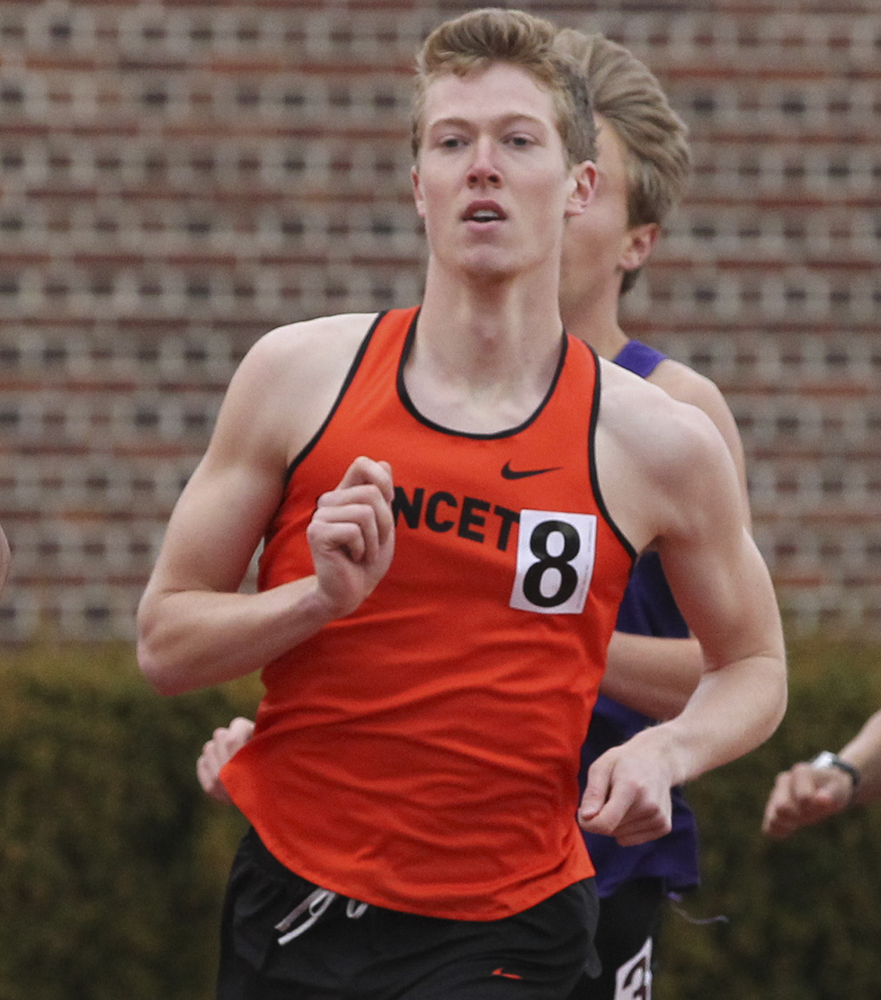

```{r setup, include=FALSE}
knitr::opts_chunk$set(echo = TRUE)
```

1. I competed in varsity track and field during my time as an undergraduate, although I wasn't incredibly competitive at the higher levels. I still run now, training to compete in 5k and 10k road races rather than my previous 800 meter track races.

<center>




Racer          | Time
-------------- | ---------
Joe            | 1:54.97
Sam (teammate) | 1:50.82

</center>

As can be seen above, I was significantly slower than my teammate, as 4 seconds over the course of an 800 meter race is practically an eternity.

2. After being sent home due to the pandemic, I attempted to teach myself the saxophone, which, I must admit, is even now progressing rather slowly. I had hoped to learn this instrument such that I could play it over my own looped bass lines.

3. When in my home state of Arkansas during the summers, I am an avid water skier. I have been doing this since I was around 8-9 years old, and my enjoyment of the activity has only grown since first learning it.

<center>


</center>

4. Despite participating in a number of high-impact activities throughout my life, from 3 years of football to 10 years of martial arts, I have never broken a bone. This surprises me just as much as it does others, if not more. 

5. I grew up fishing in the lakes and rivers around my home, a pass-time that I shared with my father and grandfather to all three of our enjoyment.
